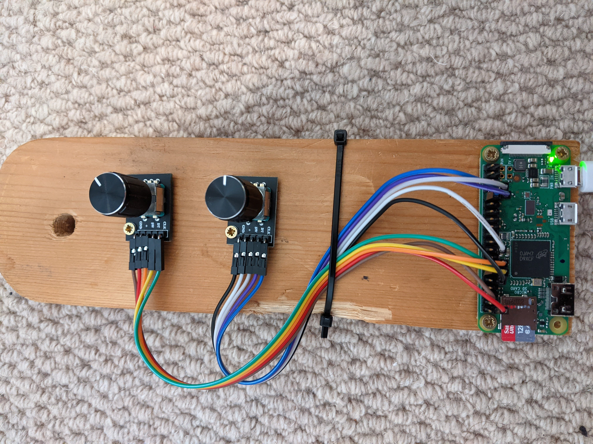

# Introduction

This project is a cheap and easy setup for a dimmer switch for a TP-Link Kasa smart bulb using the [python-kasa module](https://github.com/python-kasa/python-kasa).

# Equipment

As a minimum you will need a Raspberry Pi of any kind and KY-040 rotary encoder preferably with a switch so you can click the light on/off. I'm using a pi-zero WH which comes with WiFi and pre-soldered header pins - about £12 worth of pi plus a few quid for the encoder(s).

# Usage

0. Clone the repo into /home/pi/kasa-dimmer if you intend to use the pre-made services.
1. Configure the `DEVICE_NAME` in `controller.py` to the name as it is set in the Kasa app.
2. Install requirements with `pip install -r requirements.txt`
3. Configure each of the PIN settings in `controller.py` if you intend to use a different PIN layout to me.
4. Wire up your rotary encoder to your Pi. See the pictures above and below for reference if you intend to use the same pin layout. Note that different Pi's may have different PIN numberings.

5. Start the controller service with `python3 controller.py` and you're off! The service will take a few seconds to find your device and then should remain connected indefinitely (not yet tested!)

Additionally, for use in my room I enable two services defined in the `services/` directory - a services to start the controller services on boot and one to automatically disable the ACT light 60 seconds after boot (it's distracting). Install these automatically with `cd services && source install-services.sh`.

# Useful links

["Using KY-040 rotary encoder on Raspberry Pi to control volume"](https://blog.sharedove.com/adisjugo/index.php/2020/05/10/using-ky-040-rotary-encoder-on-raspberry-pi-to-control-volume/)

[Pi-Zero pin layout](https://cdn.sparkfun.com/assets/learn_tutorials/6/7/6/PiZero_1.pdf)

[Setting up a Pi-Zero headless and automatically connecting it to Wi-Fi](https://desertbot.io/blog/setup-pi-zero-w-headless-wifi)
